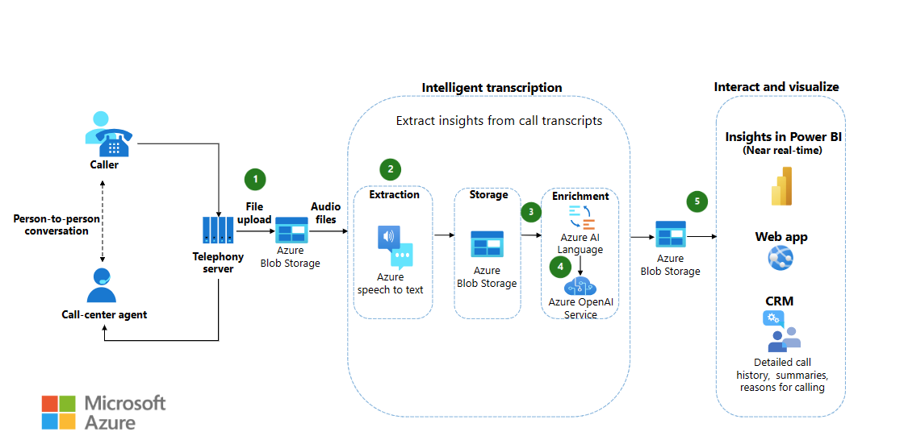
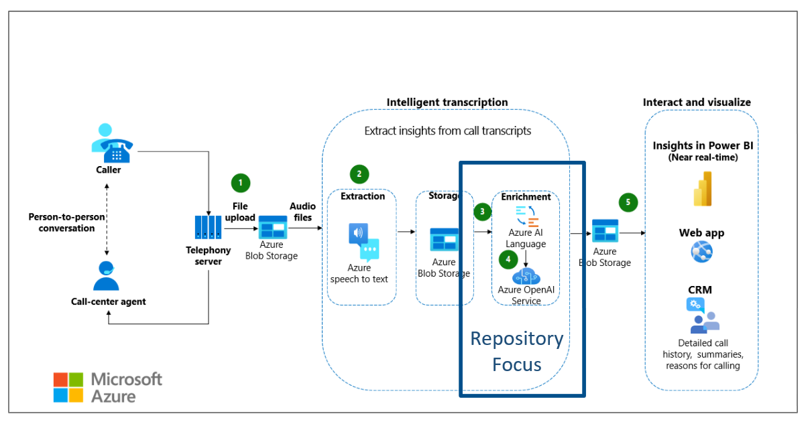

# Azure OpenAI | Call Center Starter Kit

## Overview

### Repository

This repository houses the source code for a demo application that delves into the specific aspects of executing the architecture detailed in "[Extract and analyze call center data](https://learn.microsoft.com/en-us/azure/architecture/ai-ml/openai/architecture/call-center-openai-analytics)" from Microsoft Learn.

 *An overview of the call center analytics architecture.*

The provided demo code can serve as a foundation for implementing this architecture in custom applications. It showcases the integration of various Azure services and tools—including the Semantic Kernel—to construct a robust application that leverages Azure OpenAI and Azure Cognitive Search capabilities.

 *A focus on the repository's key areas.*

To begin, clone this repository and adhere to the [setup instructions](./docs/01_DemoEnvironment/01_Environment.ipynb) outlined in the accompanying notebook to prepare your development environment. Next, peruse and customize the code within the notebooks. Additional insights into the architecture and its application can be found through the resources on Microsoft Learn.

### Folder Contents

Below is a detailed breakdown of each folder in this repository. Each section contains a descriptive overview and an architecture diagram explaining the interaction between various components and the flow of data.

| Section | Notebook  |  Description | Details |
| --------  | --------  |  ----------- | ------- |
| 00 | [Intro to OpenAI](./IntroOpenAI.md)  |  Fundamental insights into OpenAI | Features links to expansive documentation |
| [01](./docs/01_DemoEnvironment/)  | [Environment Setup](./docs/01_DemoEnvironment/01_Environment.ipynb)  |  Detailed instructions for deploying Azure Services like Azure OpenAI and Cognitive Search | Includes a `application.env` file within the [conf](./docs/01_DemoEnvironment/conf) folder containing essential configuration details |
| [02](./docs/02_REST_API/)  | [Basic Chat](./docs/02_REST_API/01_BasicChat.ipynb)  |  Examples of HTTP calls to the deployed Chat Completion LLM (gpt-3.5-turbo)  | .NET code is used to perform HTTP calls, Another option could be utilizes the [REST Client extension](https://marketplace.visualstudio.com/items?itemName=humao.rest-client) for Visual Studio Code to execute the calls |
| [02](./docs/02_REST_API/)  | [Other Models](./docs/02_REST_API/02_OtherModels.ipynb)  |  Examples of HTTP calls to various LLMs like Embedding, Whisper  | Also uses .NET to perform HTTP calls. |
| [02](./docs/02_REST_API/)  | [JSON Mode](./docs/02_REST_API/03_JsonMode.ipynb)  |  Example of HTTP calls instructing the model to respond in valid JSON format  | Also uses .NET to perform HTTP calls. |
| [02](./docs/02_REST_API/)  | [GPT-4 Vision](./docs/02_REST_API/04_MultiModalVision.ipynb)  |  Sample using text and image data as model input | gpt-4 vision is one of the first multi-modal models being able to process text and image data as input. Image data is provided as base64-encoded string
| [03](./docs/03_SDK/)  | [Chat Completion](./docs/03_SDK/01_-_ChatCompletion.ipynb)  | C# sample code to interact with the ChatCompletion LLM using the `Azure.AI.OpenAI` NuGet package |
| [03](./docs/03_SDK/)  | [Chat Completion Streaming](./docs/03_SDK/02_ChatCompletionStreaming.ipynb)  | Advanced C# sample code for streaming interactions with the ChatCompletion LLM |
| [03](./docs/03_SDK/)  | [JSON Mode](./docs/03_SDK/03_JSONMode.ipynb)  | C# sample instructing the model to respond in valid JSON format |
| [03](./docs/03_SDK/)  | [GPT-4 Vision](./docs/03_SDK/04_MultiModalVision.ipynb)  | C# sample using text and image data as model input | gpt-4 vision is one of the first multi-modal models being able to process text and image data as input. Image data is provided as URI
| [04](./docs/04_Embeddings/)  | [Basic Embeddings](./docs/04_Embeddings/01_BasicEmbeddings.ipynb)  | C# code to create embeddings with the `Azure.AI.OpenAI` NuGet package | Embeddings are numerical text representations in a 1536-dimension vector |
| [04](./docs/04_Embeddings/)  | [Cosine Similarity](./docs/04_Embeddings/02_CosineSimilarity.ipynb)  | C# examples using `MathNet.Numerics` to calculate the cosine distance between vectors | The closer the distance, the more similar the semantic meanings |
| [05](./docs/05_VectorDB/)  | [Vector Database](./docs/05_VectorDB/01_CognitiveSearch.ipynb)  | C# code for using Azure Cognitive Search as a vector database | Involves storing and querying embeddings with a created Search Index |
| [06](./docs/06_SemanticKernel/)  | [Semantic Function Inline](./docs/06_SemanticKernel/01_PlugIn_SemanticFunction_Inline.ipynb)  | Demonstrates inline definition of a Microsoft Semantic Kernel function |
| [06](./docs/06_SemanticKernel/)  | [Semantic Function File](./docs/06_SemanticKernel/02_PlugIn_SemanticFunction_File.ipynb)  | Illustrates importing a Semantic Kernel function from an external file |
| [06](./docs/06_SemanticKernel/)  | [Native Function](./docs/06_SemanticKernel/03_PlugIn_NativeFunction.ipynb)  | Example of importing a native C# function to the Semantic Kernel |
| [06](./docs/06_SemanticKernel/)  | [Memory](./docs/06_SemanticKernel/04_Memory.ipynb)  | Explanation of the Semantic Kernel Memory concept and usage |
| [06](./docs/06_SemanticKernel/)  | [Planner](./docs/06_SemanticKernel/05_Planner.ipynb)  | Overview of the Semantic Kernel planner which sequences function calls for a task |
| [06](./docs/06_SemanticKernel/)  | [Logging](./docs/06_SemanticKernel/06_Logs.ipynb)  | How to utilize the default .NET logger with the Semantic Kernel |

## What Is Generative AI?

Generative AI refers to AI systems capable of creating original content. It's commonly implemented in chat applications, such as OpenAI's [ChatGPT](https://chat.openai.com). These AI applications, powered by Large Language Models (LLMs) like those developed by OpenAI, use extensive data training to generate contextually appropriate and coherent responses.

For a comprehensive understanding of generative AI, explore Microsoft's [introduction to generative AI](https://learn.microsoft.com/en-us/training/paths/introduction-generative-ai/).

## Introduction to Azure OpenAI

Azure OpenAI, a collaborative offering from Microsoft and OpenAI, melds Azure's enterprise-grade features with OpenAI's sophisticated generative AI models. It facilitates a seamless workflow between Azure services and OpenAI while ensuring regional availability, private networking, and adherence to responsible AI practices.

## Getting Started

### Overview

- **Get Access**: Access to Azure OpenAI is currently by application only. Apply [here](https://customervoice.microsoft.com/Pages/ResponsePage.aspx?id=v4j5cvGGr0GRqy180BHbR7en2Ais5pxKtso_Pz4b1_xUOFA5Qk1UWDRBMjg0WFhPMkIzTzhKQ1dWNyQlQCN0PWcu).
- **Responsible AI**: Follow Microsoft's six principles of responsible AI as outlined [here](https://learn.microsoft.com/en-us/azure/machine-learning/concept-responsible-ai?view=azureml-api-2). Additional information on Azure OpenAI's transparency can be found in the [transparency note](https://learn.microsoft.com/en-us/legal/cognitive-services/openai/transparency-note?tabs=text).
- **Learn About OpenAI**: Enhance your knowledge through [OpenAI Learn Live](https://learn.microsoft.com/en-us/users/kimberlm/collections/ke7xh43zn1w0k7?WT.mc_id=learnlive-2023228AFT) and the [Azure OpenAI Documentation](https://learn.microsoft.com/en-us/azure/ai-services/openai/).

### Prompt Engineering

Crafting precise prompts is essential for eliciting the desired output from language models. Learn the art of prompt engineering through these resources:

- [Understanding Prompts](https://learn.microsoft.com/en-us/semantic-kernel/prompt-engineering/)
- [Mastering Prompt Engineering](https://www.youtube.com/watch?v=RxL1i6JKggg)

### Quickstarts

Jumpstart your Azure OpenAI journey with these quickstart guides:

- [Completions Quickstart](https://learn.microsoft.com/en-us/azure/ai-services/openai/quickstart?tabs=command-line&pivots=programming-language-csharp)
- [Chat Quickstart](https://learn.microsoft.com/en-us/azure/ai-services/openai/chatgpt-quickstart?tabs=command-line&pivots=programming-language-csharp)
- Explore [OpenAI Samples](https://github.com/Azure-Samples/openai) and [.NET Samples](https://github.com/Azure-Samples/openai-dotnet-samples) on GitHub.
- Discover an [AI-powered call center intelligence use case](https://github.com/amulchapla/AI-Powered-Call-Center-Intelligence).
