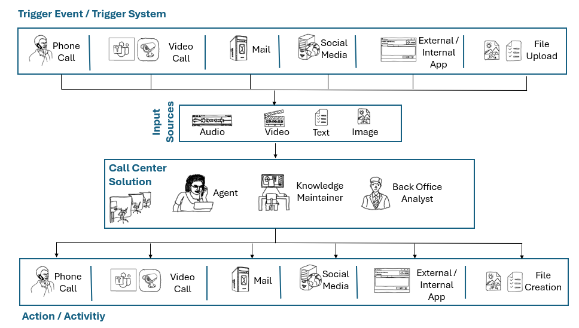

# Azure OpenAI | Starter Kit

This repository is designed to empower developers embarking on their journey to infuse existing applications with AI capabilities or construct new ones from the ground up, with Azure AI services like Azure OpenAI at the core.

This repository offers a dual-track approach to kickstart development endeavors. Firstly, within the ['docs' folder](./docs), developers and architects will find a collection of instructive polyglot notebooks elucidating fundamental concepts of integrating Azure OpenAI into custom applications.
These notebooks serve as a learning resource, enabling developers to grasp concepts and witness Azure OpenAI functionalities in action through easily consumable examples.

Secondly, the repository delves into more intricate end-to-end [scenarios](./scenarios/), crafted and primed for integration and kick starting custom application development. These scenarios serve as practical templates, facilitating seamless adoption of Azure OpenAI functionalities into diverse application landscapes.

Whether embarking on a learning journey or implementing sophisticated AI features, the Azure OpenAI Starter Kit equips developers with the tools and knowledge necessary to thrive in the realm of AI-powered applications.

## Get Started

### Create Environment

To begin, clone this repository and adhere to the [setup instructions](./docs/01_DemoEnvironment/01_Environment.ipynb) outlined in the accompanying notebook to prepare your development environment. Next, peruse and customize the code within the notebooks. Additional insights into the architecture and its application can be found through the resources on Microsoft Learn.

### Concepts and Technology

If you're interested in ramping up on fundamental concepts how to use Azure OpenAI and other Azure AI services you bes start your learning journey [here](./ExistingNotebooks.md).

For example you will learn:

- How to use Azure OpenAI [Function Calling](./docs/03_SDK/05_ChatTools.ipynb)
  
- How to get started with [Microsoft Semantic Kernel](./docs/06_SemanticKernel/README.md)
  
- How to use GPT-4 Vision [to analyze images](./docs/02_REST_API/04_MultiModalVision.ipynb)
- and many more concepts...

Check out all [existing notebooks](./ExistingNotebooks.md) and start ramping up on Azure AI services.

### Call Center Use Cases

If you're interested in how to solve challenges for specific call center roles or call center use cases you can start your learning journey [here](./UseCase.md).

You will learn how call center solutions react to multiple external triggers  to initiate activities for various roles:

You will learn for example:

- How to build a custom [policy check engine](./scenarios/01_PolicyCheckEngine/README.md) using [Embeddings](./docs/04_Embeddings/README.md)
- and many more concepts...

Check out solutions [for use cases and roles](./UseCase.md) to start ramping up on Azure AI services.
