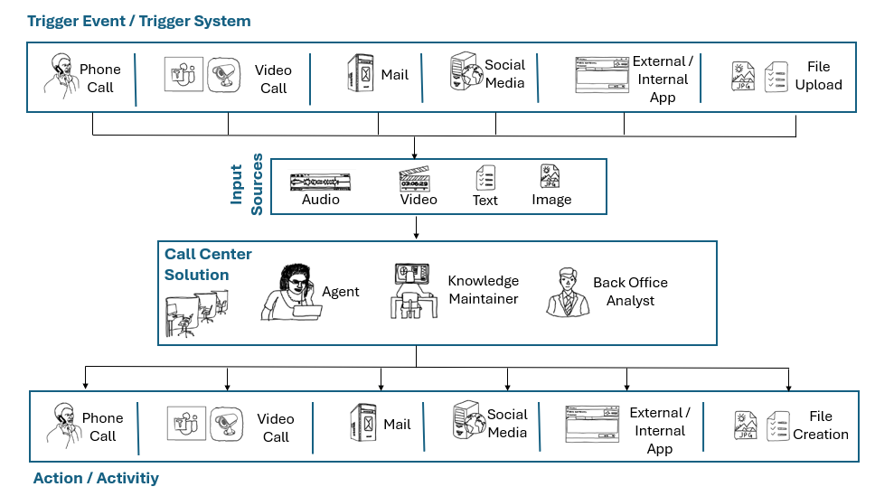

# Azure OpenAI | Starter Kit

## Architecture

Samples in this repository delves into the specific aspects of executing the architecture detailed in "[Extract and analyze call center data](https://learn.microsoft.com/en-us/azure/architecture/ai-ml/openai/architecture/call-center-openai-analytics)" from Microsoft Learn with a focus on the "Enrichment" section:
 *Repository Focus*

## Call Center Solutions

ISVs providing solutions for call centers benefit immensely from AI features provided by OpenAI models due to their ability to enhance customer interactions, streamline operations, and improve overall efficiency. OpenAI models, with their natural language processing capabilities, enable advanced voice and text analysis, allowing call centers to implement sophisticated automated systems for post-call analyze and near-real-time agent support.

This results in more personalized and effective customer interactions, reducing waiting times and enhancing the overall customer experience. Additionally, the adaptive nature of OpenAI models enables continuous learning and adaptation to evolve customer needs, ensuring that call center solutions remain at the forefront of technological innovation in delivering optimal service and support.

### Call Center Persona

The samples in this repository are centered around three pivotal roles:

- Agent
- Back-Office Analyst and
- Knowledge Maintainer

each playing a crucial part in the overall operational efficiency. Recognizing the unique responsibilities and challenges associated with these roles, content provided within this content pack is meticulously tailored to meet the specific needs of each category.

### Triggers / Actions

Call center solutions react to multiple external trigger systems to initiate activities within the system. This triggers provide data in various formats, including audio, video, text, or images. These diverse data types provide a comprehensive and multi-modal understanding of requested interactions or activities.

Typical external triggers are:

- Phone Calls
- Video Calls
- Mail systems
- Social media data
- External / internal applications
- File uploads

External trigger systems contribute multi-modal data, enhancing the information available for processing. While a phone call primarily provides audio, customers interacting via calls can supplement this with additional modalities such as uploading images, resulting in a more comprehensive dataset.

By categorizing incoming data into four types — audio, video, text, and images — diverse information can efficiently be managed and leveraged for a more holistic understanding of customer interactions.

### Roles

#### Back Office Analyst

**Description:** A Back Office Analyst plays a pivotal role in extracting meaningful insights from call center operations, generating comprehensive reports on the overall performance of the call center. Beyond statistical analysis, their responsibilities extend to providing valuable insights to aid the professional development of agents by offering constructive feedback on their performance. This involves furnishing facts and statistics derived from call center activities, contributing to an informed and data-driven approach that enhances both the efficiency of operations and the growth of individual agents.

|Content|Details|
|---|---|
| [Policy Check Engine](./scenarios/01_PolicyCheckEngine/README.md) | A policy check engine proves invaluable features for Back-Office Agents as it efficiently verifies compliance with both public regulations and customized organizational policies, ensuring accuracy and adherence to guidelines. This tool streamlines the validation process, allowing Back-Office Agents to confidently navigate complex policy landscapes and maintain operational integrity |
| Text / Batch Processing | In order to increase the performance of call center agents, a downstream batch analysis of customer conversations is necessary. The example shows a classic post-analysis of conversations using Azure Speech Insights and other Azure AI services. Transcriptions will be analyzed for sentiment, customer satisfaction etc. |
| Video / Batch Processing | In order to increase the performance of call center agents, a downstream batch analysis of customer conversations is necessary. The example shows a classic post-analysis of conversations using Azure Speech Insights and other Azure AI services. Transcriptions will be analyzed for sentiment, customer satisfaction etc. |

#### Knowledge Maintainer

**Description:**
In a call center, a Knowledge Maintainer assumes the crucial responsibility of curating and organizing information obtained from customers, including documentations, guidance, and rules. Their role involves preparing this wealth of knowledge in a format that is easily accessible and comprehensible, primarily benefiting agents but extending utility to all roles within the call center. By structuring information in a user-friendly manner, Knowledge Maintainers ensure that the collective knowledge base is readily available, empowering various team members to efficiently address customer queries, adhere to guidelines, and enhance the overall effectiveness of operations within the call center.

Content|Details|
|---|---|
| [Text Embedding Overview](./docs/04_Embeddings/README.md) | Embeddings serve as a fundamental building block for retrieving relevant grounding information in language models (LLM) prompts, capturing contextual relationships essential for accurate understanding. |
| Text Embedding Strategies | Embeddings serve as a fundamental building block for retrieving relevant grounding information in language models (LLM) prompts, capturing contextual relationships essential for accurate understanding. When creating embeddings, the strategic chunking of input data is crucial to preserve the most pertinent meaning without diluting the semantic context, ensuring that the resulting embeddings effectively represent the nuanced information within the input. |
| Image Embedding |  Embeddings serve as a fundamental building block for retrieving relevant grounding information in language models (LLM) prompts, capturing contextual relationships essential for accurate understanding. Capturing the semantic meaning of images is crucial for agents to find related image based information. |

#### Agent

**Description:** In a call center, the role of an Agent is pivotal as they directly engage with customers through various channels such as phone calls, video calls, and email threads. As human representatives, Agents play a crucial role in sales-oriented calls, conducting tele-sales with the aim of promoting products or services. Additionally, in help desk scenarios, Agents address and solve diverse customer problems, requiring sophisticated systems to assist and guide them through the intricacies of customer interactions. The Agent serves as the frontline communicator, embodying the brand and ensuring a positive and effective customer experience across different communication channels.

|Content|Details|
|---|---|
| [Dynamic Flow Adoption SDK](./docs/03_SDK/05_ChatTools.ipynb) | Knowledge Maintainers often create an inflexible structure for agents to follow within calls, based on customer requirements, which can become challenging when customers deviate from the specified steps. In such scenarios, the ability of Language Models (LLMs) to determine dynamic function calls and program sequences becomes crucial, showcasing their potential to guide agents through varied execution paths for business logic in response to dynamic customer interactions. |
| NRT Text Insights | Call center agents need near-real-time support to perform their tasks optimally during customer conversations. It will be highlighted how incoming audio streams can be analyzed to provide further insights and data points to the agent. Sample data points can be customer sentiment, customer satisfaction etc. This will be achieved by continuously chunk the incoming audio stream and create insights  |
| NRT Video Insights | Call center agents need near-real-time support to perform their tasks optimally during customer conversations. It will be highlighted how incoming video streams can be analyzed to provide further insights and data points to the agent. Sample data points can be customer sentiment, customer authentication etc. |
| [NRT Image Insights](./docs/02_REST_API/04_MultiModalVision.ipynb) | Call center agents need near-real-time support to perform their tasks optimally during customer conversations. It will be highlighted how incoming image data (e.g. image of form, product defects etc.) can be analyzed to provide further insights and data points to the agent. |
