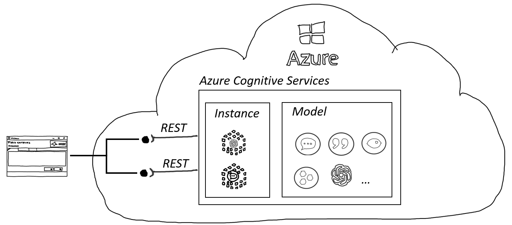

# Calling LLM using REST API

Learn how to interact with OpenAI's Large Language Models (LLMs) via REST API. This guide will use the VS Code extension to demonstrate API calls.

## Overview

Azure OpenAI, part of Azure Cognitive Services, offers AI models and tools for building intelligent applications. Its REST API endpoints for LLMs enable integration into various applications for tasks like natural language understanding and speech-to-text.

 *Azure OpenAI REST API interaction overview.*

The REST API provides access to cutting-edge features, often available before SDK implementations, allowing developers to leverage the latest LLM capabilities in a flexible manner.

## Prerequisites

Ensure you have the following before starting:

- **VS Code**: The editor where we'll write and execute our API calls.
- **Azure OpenAI Credentials**: Obtain your key and endpoint from the [Azure portal](https://portal.azure.com/).

Store sensitive information like API keys and endpoints in an `.env` file to keep your code secure.

| Folder | Content | Details |
| ------ | ------- | ------- |
| / | [01_BasicChat.ipynb](01_BasicChat.ipynb) | Polyglot Notebook for a chat application using REST |
| / | [02_OtherModels.ipynb](02_OtherModels.ipynb) | Notebook for calling models like whisper and ada via REST |

## Making Your First Call

To call the OpenAI endpoint, structure your HTTP requests as follows:

```
<Http Method> https://<aoai endpoint>/deployments/<deployment id>/query?api-version=<version>
```

The body or payload of each call is in JSON format. The following is an example of a call to the OpenAI endpoint:

```
@SubscriptionKey=<api-key>
@EndPoint=<end-point>
@EmbeddingModel=text-embedding-ada-002 #as an example

POST {{EndPoint}}/deployments/{{EmbeddingModel}}/embeddings?api-version=2023-05-15
Content-Type: application/json
api-key: {{SubscriptionKey}}

{
    "input": "This is a test"  
}

```

The response would look like this (the 1536 dimensional vector is truncated):

```
HTTP/1.1 200 OK
Content-Length: 33437
Content-Type: application/json
apim-request-id: afa96e36-c368-482e-98b6-f478381b707d
x-ms-region: East US
x-content-type-options: nosniff
openai-processing-ms: 29.1074
access-control-allow-origin: *
x-request-id: 838e82e7-c9aa-4f00-971a-eb90252ebae1
x-ms-client-request-id: afa96e36-c368-482e-98b6-f478381b707d
Strict-Transport-Security: max-age=31536000; includeSubDomains; preload
Date: Sun, 10 Sep 2023 12:05:40 GMT
Connection: close

{
  "object": "list",
  "data": [
  ],
  "model": "ada",
  "usage": {
    "prompt_tokens": 4,
    "total_tokens": 4
  }
}
```


In this response, you can see information like token usage and processing time. The data section would typically contain the output vector.