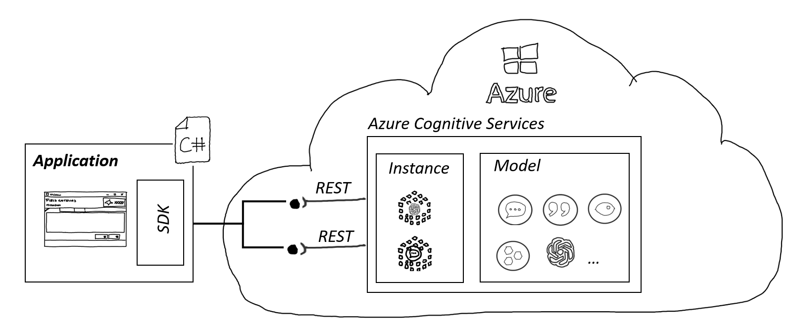
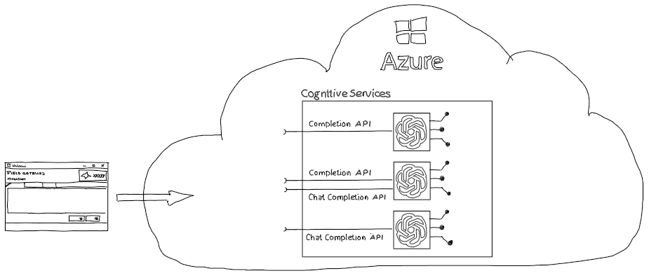

# Calling LLM using SDK

## Overview

The Azure OpenAI client library for .NET allows developers to seamlessly integrate Azure OpenAI into their applications using familiar C# concepts. It provides an idiomatic interface for interacting with Azure OpenAI services and is suitable for both Azure-hosted and external OpenAI resources.



The ChatCompletion interface from OpenAI models is a way to interact with Large Language Models like gpt-35-turbo or gpt4 using a chat format. Unlike the Completion API, which takes a single text input as a prompt, the ChatCompletion API takes multiple text inputs as messages, each with a role and a content.

The roles can be either “system”, “user”, or “assistant”. The system role is used to provide instructions or settings for the assistant, such as its personality or behavior. The user role is used to provide queries or inputs from the human user. The assistant role is used to provide responses or outputs from the model. Providing data for user and assistant as part of the request supports few-shot learning, which trains the model on a small number of labeled samples per request.

The ChatCompletion API also accepts parameters such as top_p, temperature, frequency_penalty, and presence_penalty, which control the randomness and diversity of the generated text. 

The ChatCompletion API is supported by models starting with gpt-35-turbo, which also support the Completion API. However, older models only support the Completion API and newer models like gpt-4 only support the ChatCompletion API.



Microsoft provides with the Azure.AI.OpenAI nuget package a library that simplifies the use of OpenAI models in .NET applications. It encapsulates the REST API endpoints from the large language model instance and provides the functionality in an easy to adopt and to consume way.

The SDK covers all communication aspects like authentication and authorization, data exchange, error handling, and content filtering. The SDK also integrates with other Azure SDK components, such as Azure Identity and Azure Core, to provide a consistent and seamless experience for .NET developers.

More information: 
- [Azure OpenAI client library for .NET](https://learn.microsoft.com/en-us/dotnet/api/overview/azure/ai.openai-readme)
- [GitHub](https://github.com/Azure/azure-sdk-for-net/blob/main/sdk/openai/Azure.AI.OpenAI/README.md)
- [nuget.org](https://www.nuget.org/packages?q=azure.ai.openai)


## Getting Started

To work with the Azure OpenAI SDK in your .NET application, you can directly load the required packages in your polyglot notebooks using the following command:

```csharp
#r "nuget: Azure.AI.OpenAI, 1.0.0-beta.8"
```

You will notice all packages are added the same way.

## Folder Contents

Explore the following notebooks in this repository to learn how to create chat applications using the SDK:

| Folder | Content | Details |
| ------ | ------- | ------- |
| / | [01-ChatCompletion](./01_ChatCompletion.ipynb) | Demonstrates creating a chat application using the SDK. Comparable to the REST API's BasicChat example. |
| / | [02-ChatCompletionStreaming](./02_ChatCompletionStreaming.ipynb) | Shows how to implement chat functionality with streaming capabilities using the SDK. |
| / | [03-JSONMode](03_JSONMode.ipynb) | Shows how to implement functionality to instruct the LLM to return responses in JSON format |

These notebooks are replete with detailed explanations at each step, making them a comprehensive guide for developers at all levels.

## Example Usage

Here's an example of how to use the SDK to send a completion request:

```csharp
using Azure.AI.OpenAI;

var client = new OpenAIClient(new Uri("your-openai-endpoint"), new AzureKeyCredential("your-api-key"));
var response = await client.Completions.CreateAsync(new CompletionRequest("Translate 'Hello, world!' to Spanish."));
Console.WriteLine(response.Value.Choices[0].Text);
```
