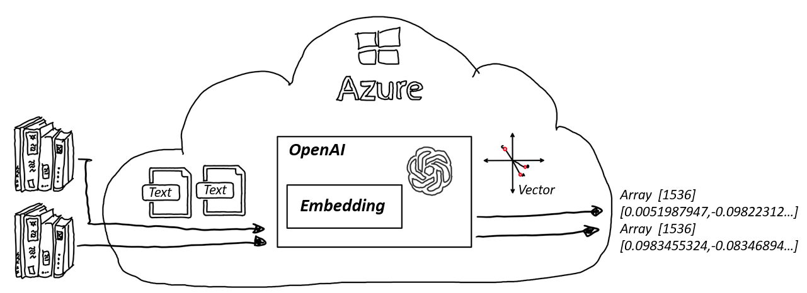

# Generating Embeddings

## Overview

Embeddings are vector representations of words or sentences that capture their ***meaning*** and ***context***. Each embedding is a vector of floating-point numbers, such that the distance between two embeddings in the vector space is correlated with semantic similarity between two inputs.

Embeddings is in machine learning terms, a feature vector. Embeddings can be used for various tasks. In the context of this Starter Kit Embeddings are used to perform semantic search on provided text information.

Embeddings are computed by Azure OpenAI models that are trained on large amounts of data and can capture the nuances of natural language.

Different Azure OpenAI embedding models are specifically created to be good at a particular task:

- Similarity embeddings: good at capturing semantic similarity between two or more pieces of text
- Text search: helps measure whether long documents are relevant to a short query
- Code search: useful for embedding code snippets and embedding natural language search queries

[Read more about embeddings](https://learn.microsoft.com/en-us/semantic-kernel/memories/embeddings)

## Folder Contents

Explore the following notebooks in this repository to learn how to create and use embeddings using the SDK:

| Folder | Content | Details |
| ------ | ------- | ------- |
| / | [01-BasicEmbeddings](./01_BasicEmbeddings.ipynb) | Demonstrates creating embeddings. Two embeddings are created: Content from a file provided within this repo and a short question |
| / | [02-CosineSimilarity](./02_CosineSimilarity.ipynb) | Shows how to calculate cosine distance between vectors. Vectors with a small cosine distance are semantically closer to each other than vectors with bigger cosine distance. |

These notebooks are replete with detailed explanations at each step, making them a comprehensive guide for developers at all levels.
