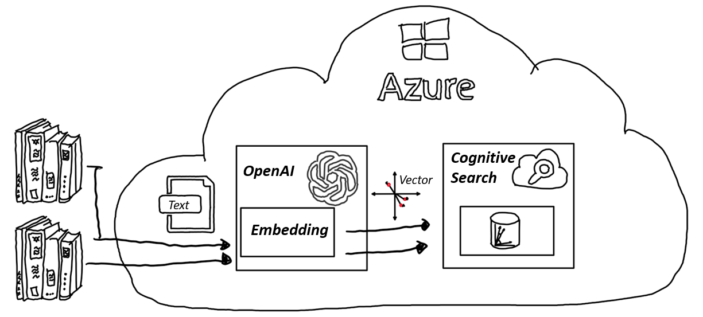

# Using Vector DBs

## Overview

Vector databases are specialized databases designed to handle vector embeddings, which are numerical representations of data objects, including text. These embeddings are indexed to facilitate rapid searches, making vector databases highly effective for managing and querying large datasets containing vectors.

Azure Cognitive Search is a notable player in this domain, providing a cloud search service that enables developers to build rich search experiences over private, heterogeneous content across various applications. 

Azure Cognitive Search has introduced Vector search, currently in public preview, which extends its capabilities to handle vector embeddings. It doesn't generate embeddings internally; instead, it relies on external models, like Azure OpenAI, to create embeddings for text, images, audio, etc., which are then indexed and made searchable within Azure Cognitive Search. This feature allows for more advanced search and retrieval operations, leveraging the semantic similarity between vector embeddings to deliver more relevant results.

- [Further Reading on Azure Cognitive Search](https://learn.microsoft.com/en-us/azure/search/search-what-is-azure-search)

## Folder Contents

Explore the following notebooks in this repository to learn how to create embeddings, store and query them in Azure Cognitive Search:

| Folder | Content | Details |
| ------ | ------- | ------- |
| / | [01-CognitiveSearch](./01_CognitiveSearch.ipynb) | Demonstrates creating embeddings, storing and querying them using Azure Semantic Search |

The notebook is replete with detailed explanations at each step, making it a comprehensive guide for developers at all levels.