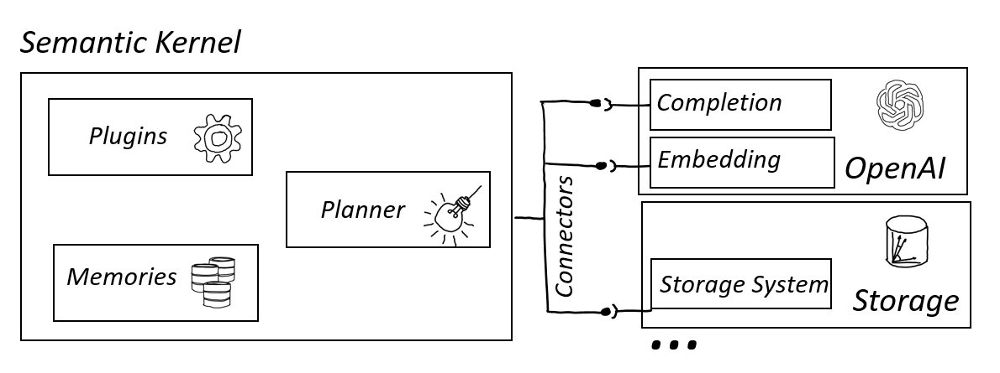
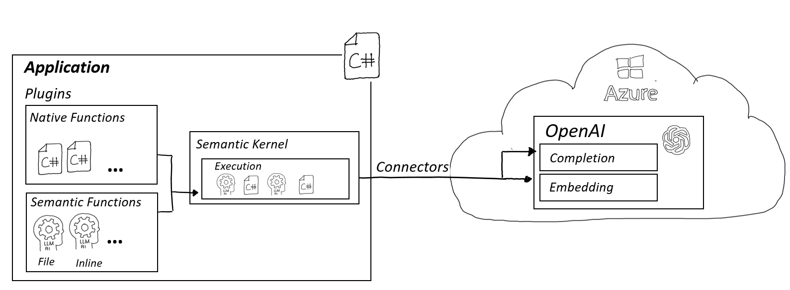
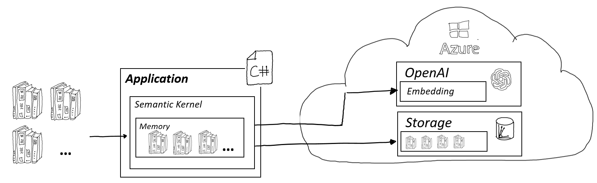
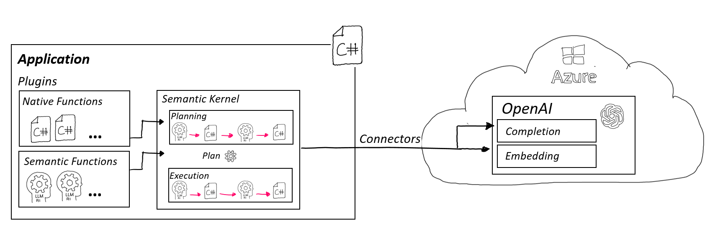
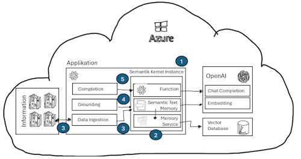

# Semantic Kernel

## Introduction

The [Azure Semantic Kernel](https://github.com/microsoft/semantic-kernel) is an open-source SDK that facilitates the integration of large language models (LLMs) with programming languages like C#, Python, and JavaScript. Utilized by Microsoft for AI application development, including Co-Pilots, this SDK is designed for modularity and extensibility, featuring core concepts like Plugins, Memory, Planner, and Connections.

 *A visual representation of the Semantic Kernel's core concepts.*

Plugins extend SDK functionality; Memory serves as a context store; the Planner generates goal-oriented plans; and Connections interface with external data sources and services.

For more details, visit the [Semantic Kernel documentation](https://learn.microsoft.com/en-us/semantic-kernel/).

## Core Concepts

Before diving into the core concepts, it's essential to understand that the Semantic Kernel is structured to enhance AI application development through these foundational elements.

### Plugin / Functions

Plugins in Semantic Kernel encapsulate functions that applications can use. These include semantic functions—defined inline or via files—and native functions. They streamline tasks where LLMs are advantageous, offering a unified interface for function calls.

 *The structure of Plugins in the Semantic Kernel.*

#### Sample Plugins

- [Semantic Function Inline](./01_PlugIn_SemanticFunction_Inline.ipynb): Learn to define and execute a semantic function directly within your code.
- [Semantic Function File](./02_PlugIn_SemanticFunction_File.ipynb): Discover how to create semantic functions in a file and integrate them with the Semantic Kernel.
- [Native Function](./03_PlugIn_NativeFunction.ipynb): See how to incorporate a native C# function within the Semantic Kernel framework.

#### Plugin Documentation

- [AI Plugins in Semantic Kernel](https://learn.microsoft.com/en-us/semantic-kernel/ai-orchestration/plugins/?tabs=Csharp): A guide to understanding and using AI plugins.
- [Inline Semantic Functions](https://learn.microsoft.com/en-us/semantic-kernel/ai-orchestration/plugins/semantic-functions/inline-semantic-functions?tabs=Csharp): Instructions for creating semantic functions inline.
- [Using Native Functions](https://learn.microsoft.com/en-us/semantic-kernel/ai-orchestration/plugins/native-functions/using-the-skfunction-decorator?tabs=Csharp): How to execute native code with the Semantic Kernel.

### Memory

Semantic Kernel's Memory abstracts the embedding model and vector databases, simplifying context management for AI applications. It's agnostic to the underlying LLM or Vector DB, offering a uniform developer experience.

 *An overview of Memory in Semantic Kernel.*

#### Memory Examples

- [Using Memory](./04_Memory.ipynb): A practical example of storing and retrieving information using Semantic Kernel's Memory.

#### Memory Documentation

- [Understanding Memories](https://learn.microsoft.com/en-us/semantic-kernel/memories/): Explore the concept and functionalities of Memories.
- [Vector Databases](https://learn.microsoft.com/en-us/semantic-kernel/memories/vector-db): Learn about vector databases and their role in AI contexts.

### Planner

The Planner is a novel feature of the Semantic Kernel that devises execution strategies from user requests. It dynamically orchestrates Plugins to fulfill complex tasks with AI-assisted planning.

 *Illustration of how the Planner operates within the Semantic Kernel.*

#### Planner Examples

- [Implementing the Planner](./05_Planner.ipynb): Understand how the Planner integrates multiple functions to achieve a user's goal.

#### Planner Documentation

- [AI Orchestration with Planners](https://learn.microsoft.com/en-us/semantic-kernel/ai-orchestration/planners/): An in-depth look at the Planner's AI orchestration capabilities.

### RAG

Semantic Kernel makes it easy for developers to implement a RAG (Retrieval Augmented Generation) pattern by providing an abstraction layer to OpenAI models and Vector Databases.

Steps to implement a RAG pattern:

1. Create Semantic Kernel instance
2. Create Semantic Text Memory and Semantic Memory Service
3. Ingest Data which is used to ground user queries into Semantic Text Memory
4. Retrieve grounding information form Semantic Text Memory based on user query
5. Complete user query (user query & retrieved grounding information) by calling ChatCompletion endpoint

#### RAG Example

- [RAG using Sematic Kernel](./07_RAG_Pattern.ipynb): A simplified in-depth look how to implement a RAG pattern using Semantic Kernel.

