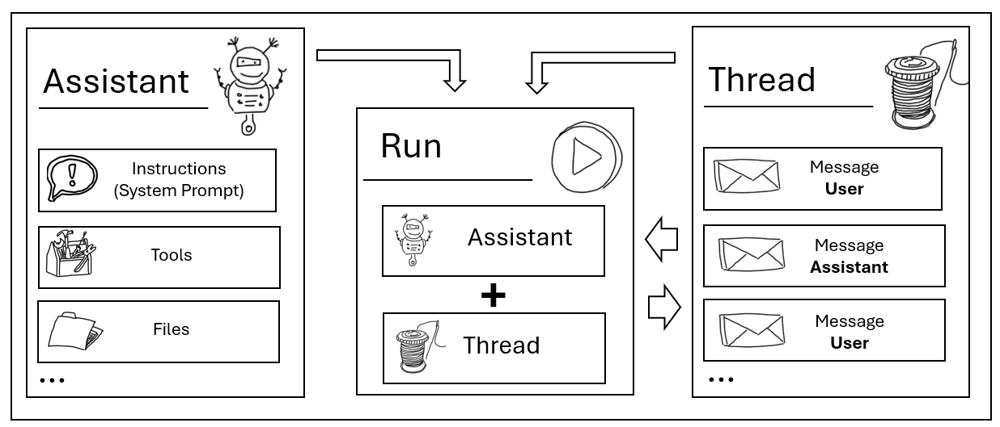
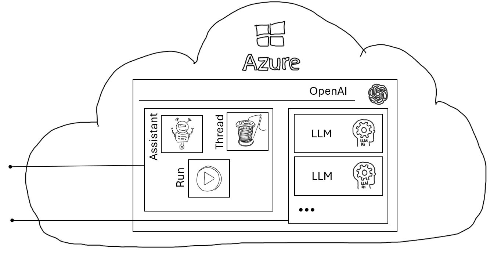

# Assistants API

## Introduction

OpenAI has introduced the [Assistants API](https://platform.openai.com/docs/assistants/overview) as a means to interact with OpenAI LLMs (Large Language Models), offering a tailored approach for deploying conversational agents powered by these advanced models.

Unlike the existing Completion and Chat APIs, which provide general text generation capabilities, the Assistants API is designed to manage conversation flow, context, and session persistence, enabling more sophisticated interactions with users over multiple turns.

This Assistants API facilitates the creation of virtual assistants capable of maintaining coherent dialogues, understanding context, and executing complex tasks, thereby enhancing the user experience and expanding the utility of OpenAI's language models in practical applications.

For more details, visit the [Azure Assistants API interface](https://learn.microsoft.com/en-us/azure/ai-services/openai/assistants-reference) and check out the official [nuget page for .NET integration](https://www.nuget.org/packages/Azure.AI.OpenAI.Assistants/1.0.0-beta.3).

## Assistants API Abstractions

Before diving into examples, it's essential to understand that the Assistants API can enhances the development of applications like Copilots and their ability to manage conversation flows. To simplify this the Assistants API provides the following abstractions:

- **Assistant:** defines e.g. the system prompt and therefore the "capabilities" of the assistant. It allows enabling various existing tools like the code-interpreter and allows the configuration of function calling.
- **Thread:**: Preserves the history of any conversation. Within a thread all user messages (questions or tasks to the assistant) are stored as well as all assistant responses (answers to user messages).
- **Run:**: Within a run an Assistant and a Thread are brought together and with the help of a LLM instance the completion (answer) of user message(s) (questions) are performed. Run is an asynchronous process and it's state and results can be retrieved at any time.

## State

Thread messages and Assistant configuration (e.g. system prompt) are stored at the API level. This means by using the Assistants API state is stored at the cloud service level:

The Assistants API makes those LLM based abstractions available to clients.

## Samples

- [Simple Run:](./01_SimpleRun.ipynb): A notebook highlighting the creation of an Assistant and a Thread. Adding user messages to the Thread and creating a Run as well as retrieving assistant created messages after successful Run execution. 
- [Tool (Code Interpreter)](./README.md): Coming soon. A sample which uses the code interpreter tool to analyze provided documents.  
