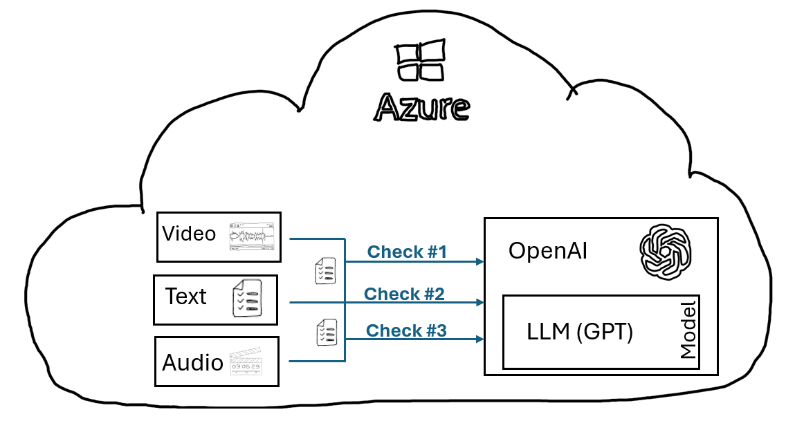
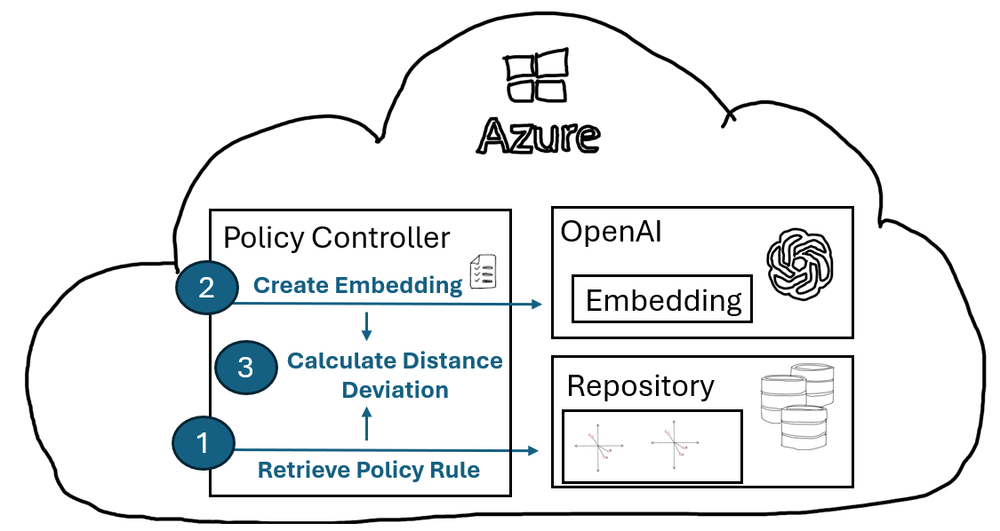
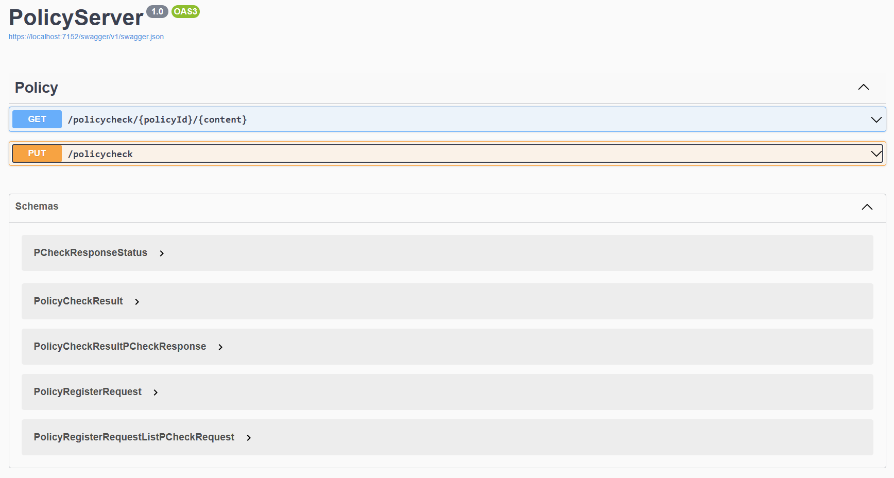

# Scenarios - Policy Check Engine

## Scenario Description

LLMs (Large Language Models) like chatGPT can help extract insights from provided text by utilizing their natural language processing capabilities to identify patterns, relationships, and key information within the text, enabling a deeper understanding of its content; to analyze if a provided input text complies with policies like GDPR or even custom defined policies.

Complex or multi-step policies may necessitate multiple calls to the LLM in order to comprehensively asses text content, such as first identifying the presence of intelligence information and then employing custom, discrete checks tailored to the specific finding.



### Challenges

- Strategies to avoid multiple LLM calls requires tailoring a custom prompt which addresses all potential checks within a single call or at least few calls. This might end in complex and hard to manage prompts.

- Token limits, performance and associated costs pose another challenge as not unlimited text at a high frequency can be provided to the LLM to get analyzed for potential certain policy violations.

## Scenario Solution

### Embeddings

Embeddings are numerical representations of words or phrases that capture semantic relationships and conserve the semantic meaning, enabling them to be used to contextualize and enrich LLM calls with relevant information ([Embeddings Overview](../../docs/04_Embeddings/README.md)).

Embeddings can be employed to check if provided text contains expected content by measuring the semantic similarity between the provided text and a predefined expected phrase or text, thereby distinguishing the most contextually relevant responses.

### Policy Definition

In the context of this simplified demo application a policy is composed of policy rules. A policy rule is a single task or check which can be executed against provided text and provides insights if the specific rule has been fulfilled.

**Example:** A policy rule defines that a customer needs to be authenticated by providing a PIN. The policy rule will determine if a question semantically near has been asked during a conversation. If a "semantic near" phrase has been provided the policy rule can be seen as respected.

**Policy Rule**:

A policy rule can be defined by providing the following information:

- ***"PolicyRuleID"***: A unique ID for the policy
- ***"ContentToLookFor"***: A phrase, question, or content that, when mentioned in the conversation, validates the policy. In the specific example it is the question "What's your PIN?". If the question was asked, authentication was done according to the policy.
- ***PotentialPhrases***: An array of additional phrases which would fulfill the policy.
- ***OffTopicPhrases***: An array of questions or content which is related but does not validate the policy.

```json
    { 
      "PolicyRuleId": "Auth-KnowHow-01",
      "ContentToLookFor": "What's your PIN?",
      "PotentialPhrases": [
        "Can you tell me your PIN?",
        "What's your Personal Identification Number?",
        "What's your PIN number?"
      ], 
      "OffTopicPhrases": [
        "What's your bank account?",
        "What business are you doing?"
      ]
    }
```

### Policy rule registration

Policy rules can be registered with the system by performing a **HTTP PUT** against the [*/policyrulecheck*](./src/PolicyServer/Controllers/PolicyController.cs) endpoint:

```csharp
[HttpPut]
[Route("/policyrulecheck")]
public async Task<ActionResult<PolicyRuleCheckResponse<PolicyRuleCheckResult>>>         RegisterPolicyRule(
    IOpenAI openAI,
    IRepository<PolicyRule> policyRepository,
    [FromBody]PolicyRuleCheckRequest<List<PolicyRuleRegisterRequest>> request) { ... }
```

As payload a [list of PolicyRuleRegisterRequest](./src/PolicyServer/Models/PolicyCheckModels.cs) `PolicyRuleCheckRequest<List<PolicyRuleRegisterRequest>>` is expected:

```csharp
public class PolicyRuleCheckRequest<T> where T : new()
{
    [JsonPropertyName("Request")]
    public T RequestData { get; set; } = new T();
}

public class PolicyRuleRegisterRequest
{
    [JsonPropertyName("PolicyId")]
    public string PolicyId {get; set;} = string.Empty;
    
    [JsonPropertyName("ContentToLookFor")]
    public string ContentToLookFor {get; set;} = string.Empty;
    
    [JsonPropertyName("PotentialPhrases")] 
    public string[] PotentialPhrases {get; set;} = new string[0]; 
    
    [JsonPropertyName("OffTopicPhrases")]
    public string[] OffTopicPhrases {get; set;} = new string[0];    
}
```

The following steps are executed during policy registration and policy storage in an [in-memory repository](./src/PolicyServer/Util/Repository/PolicyRepository.cs):

- Embedding creation for "ContentToLookFor" using Azure OpenAI and a deployed embedding model.
- Embedding creation for each entry in "PotentialPhrases" and "OffTopic".
- Calculation of the cosine distance to "ContentToLookFor" for both "PotentialPhrases" and "OffTopicPhrases".

### Policy rule check

Policy rule compliance can be checked by performing a HTTP get against the [*/policyrulecheck*](./src/PolicyServer/Controllers/PolicyController.cs) endpoint. The Id of the policy and the content which should be checked, needs to be provided.

```csharp
[HttpGet]
[Route("/policyrulecheck/{policyId}/{content}")]
public async Task<ActionResult<PolicyRuleCheckResponse<PolicyRuleCheckResult>>> CheckPolicyRule(
    IOpenAI openAI,
    IRepository<PolicyRule> policyRepository,
    string policyId, 
    string content) { ... }
```

The policy check performs the following steps:



**(1):** Retrieve registered policy rule. This includes the embedding for "ContentToLookFor" and average cosine distance for "Potential Phrases" and "OffTopicPhrases"

**(2):** Create embedding out of the provided "content"

**(3):** Calculate the cosine difference between "content" and "ContentToLookFor". Calculate deviation (%) from the average "OffTopicPhrases" and "PotentialPhrases" distances.

By analyzing the above results a solid indication if the policy was respected can be provided.

## Sample

- Start the asp.net server by executing `dotnet build` in the [project folder](./src/PolicyServer/). 
- Start a browser and point it to ```http://localhost:<your port number>/swagger/index.html```
  
- Choose the second option (PUT /policyrulecheck)
- Provide the content from [this JSON file](../../assets/scenarios/01_PolicyCheckEngine/request_data/PUT-PolicyCheck.json) as payload and execute the call. This will register 4 policies. (This step is optional as the application loads policies during startup also from [here](../../assets/scenarios/01_PolicyCheckEngine/preloaded_policies/). 
- Choose the first option (GET /policyrulecheck/{policyId}/{content}) and provide the following values:
  - policyId: ***Auth-KnowHow-01***
  - content: ***What's your PIN or PINs?***
    - Check the response

      ```json
      {
        "Result": {
          "CalculatedDistance": 0.04175709,
          "AvgOptimalDistance": 0.054822758,
          "AvgOffTopicDistance": 0.17467114,
          "DeviationOptimalDistance": 23.832565,
          "DeviationOffTopicDistance": 242.4432
        },
        "Status": 0,
        "Error": []
      }
      ```

      - `CalculatedDistance` is the distance between content (= What's your PIN or PIN's?") and "ContentToLookFor" of the policy. 
      - `CalculatedDistance` smaller than `AvgOptimalDistance` indicates that the provided content has an "semantically nearer" meaning than the average of "PotentialPhrases". A strong indicator that the policy is respected.
      - `DeviationOptimalDistance` and `DeviationOffTopicDistance` show the respective deviation in %.
  - Redo with content: ***Can you tell me your age?***
    - Check the response

      ```json
      {
        "Result": {
           "CalculatedDistance": 0.17989132,
           "AvgOptimalDistance": 0.054822758,
           "AvgOffTopicDistance": 0.17467114,
           "DeviationOptimalDistance": -228.13255,
           "DeviationOffTopicDistance": -9.521912
        },
        "Status": 0,
        "Error": []
      }
      ```

    - It shows a 228.13255 percentage deviation from the avg optimal distance.
