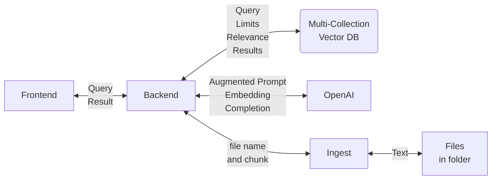
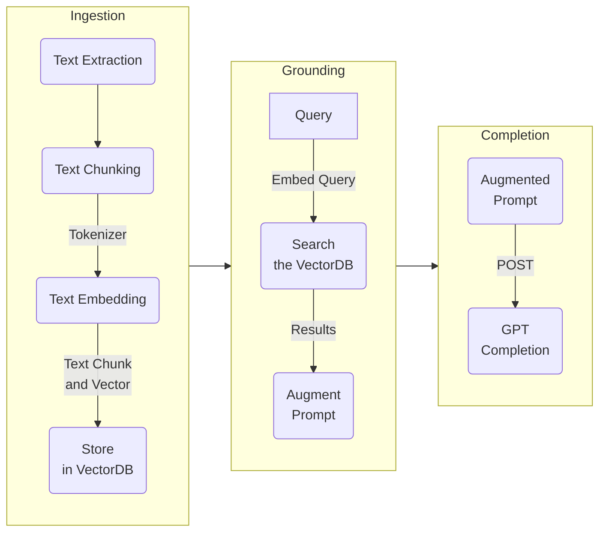

# RAG Pattern

## 1: Overview

The Retrieval Augmentation Generation (RAG) architecture enhances the abilities of a Large Language Model (LLM) such as ChatGPT by incorporating an information retrieval system. This system offers relevant data to support the LLM's responses. By integrating an information retrieval system, you gain the ability to control the grounding data utilized by the LLM when generating a response. In the context of an enterprise solution, the RAG architecture allows you to confine generative AI to your organization's content, which can be sourced from vectorized documents, images, and other data formats if you have embedding models for that content.

## 2: Areas of concern

There are areas of concern that need to be taken into consideration in RAG patterns such as:

- Ingestion
  - Managing the sources (text, PDFs, images, etc.).
  - Extracting the text from the sources.
  - Maybe keeping track of the source locations (to quote references).
- Text Chunking or smart chunking
  - Chunking large text sources into smaller pieces.
- Embedding and vector DB storage
  - Embedding the text chunks (basically, convert the text to a numerical vector representation)
  - Saving the chunks in a vector DB. In SK, the text and the text embedding are called a memory.
- Working with Token Limits
  - Token limitations in the LLM and embedding models.
  - In OpenAI GPT models, the token limits apply to both a prompt and completion. In other words, if the token limit is 2048, and the prompt is 1800 tokens, the maximum response can be 248 tokens.
- Processing Prompt and completions
  - Turning the query into an embedding
  - Comparing the query embedding against the vector DB embeddings returning the relevance scores and requested limits.
  - Using the text in the top relevant results to augment the prompt.
  - Sending the prompt for completion with the original query and the augmented context.

## 3: Sample Application Diagram

## 4: RAG Pattern Stages

### 4.1: Ingestion

Ingestion is the process of extracting the text from your source files, chunking, and vectorization the chunks, and saving the chunks to a vector database (sometimes this is called memorization).

Most application will generally have an ingestion application to help with ingestion.

#### 4.1.1: Text extraction

During this stage, the source files need to be read, and the text extracted. This could involved for example reading the text in PDF files or describing the content of images using services such a GPT with vision.

#### 4.1.2: Text chunking

Text chunking is a technique that divides a text into smaller units, such as sentences, phrases, or words.

#### 4.1.3 Text vectorization and storage

One a the content of documents are read and chunked, they are embedded and stored in a vector database. An embedding is a vector. The ADA service generally produce a vector or an array of 1536.

### 4.2: Grounding

### 4.2.1: Searching

During this stage, the user submits a question to the system. The system embeds this questions, and compare the embeddings generated against the embeddings in a vector database. The user or the system can state how many embeddings to use for a given relevance raking. The system will then return the text chunks and embeddings for all those chunks that meet the relevance threshold and a maximum number chunks by the requested limit.

### 4.2.2: Prompt Augmentation

Those chunks having a high relevance are returned and used to augment the prompt together with the initial query.

Reference:

**[What is Grounding?](https://techcommunity.microsoft.com/t5/fasttrack-for-azure/grounding-llms/ba-p/3843857)** "Grounding is the process of using large language models (LLMs) with information that is use-case specific, relevant, and not available as part of the LLM's trained knowledge."

### 4.3: Process the Prompt for Completion

The augmented Prompt is submitted for Completion, and the results of the Completion are return to the user.

## 5: Best practices

- Review the extracted text and apply cleanup and reformatting if necessary
- Use the playground to iterate over different prompts (prompt engineering)
- Take advantage of your model's token limits
  - Be mindful to include the completion tokens in this analysis
- Test different combinations of chunking logic and chunk sizes
  - A good starting point is 1024K tokens
- Involve SMEs in reviewing the quality and context of recalled memories against the queries
- Apply quality and RAI baselines to the expected results

## 6: RAG Application Samples

- [Simple SK RAG Pattern C# Interactive Notebook](https://github.com/Azure-Samples/aoai-net-starterkit/blob/main/docs/06_SemanticKernel/07_RAG_Pattern.ipynb)
- [Full C# App](https://github.com/Azure-Samples/azure-search-openai-demo-csharp)
- [Full Python App](https://github.com/Azure-Samples/azure-search-openai-demo)
