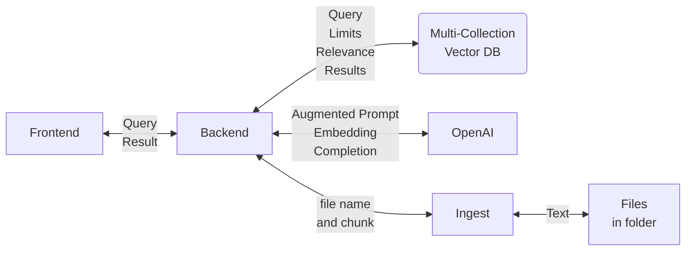
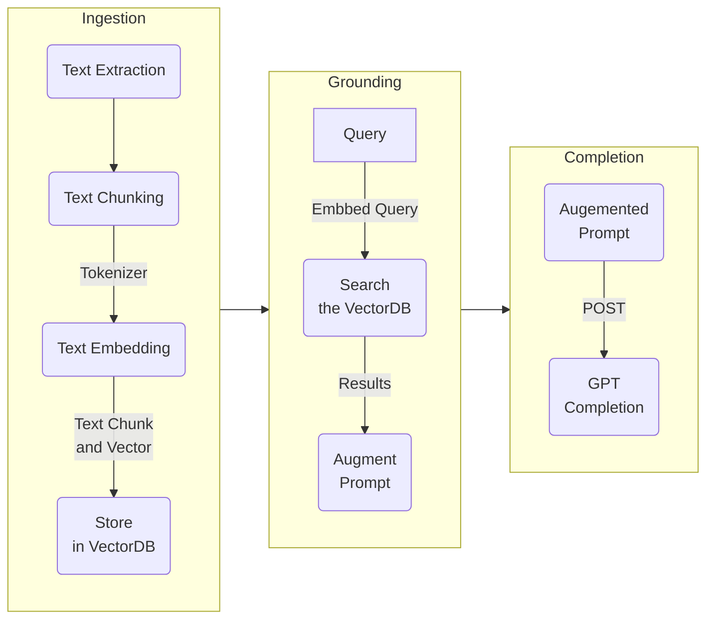

# RAG pattern with Semantic Kernel

## Scenario Description

RAG stands for Retrieval Augmented Generation, which is a generative AI design pattern that involves combining a large language model (LLM) with external knowledge retrieval. RAG is required to connect real-time data to your generative AI applications, such as chatbots, question answering systems, or content generation. RAG improves the accuracy and quality of the application, by providing your data as context to the LLM at inference time1.

In RAG, there are two main steps: retrieval and generation. In the retrieval phase, when the user submits a query, this triggers a relevancy search among the external documents, such as web pages, PDFs, wikis, or tabular data. The RAG system then grabs snippets of information that are related to the query and adds them to the prompt in the context window. In the generation phase, the LLM uses the prompt and the retrieved information to generate a response to the query, using its natural language understanding and reasoning capabilities.

RAG is a cutting-edge design pattern that enables LLMs to utilize specific industrial data when responding to prompts directly. By incorporating in-context learning, RAG allows LLMs to reason based on private contextualized data, thereby providing deterministic answers instead of probabilistic responses based on existing public information2.

Reference:

- [Retrieval Augmented Generation](https://learn.microsoft.com/en-us/azure/search/retrieval-augmented-generation-overview)

### Challenges

There are areas of concern that need to be taken into consideration in RAG patterns such as:

- Ingestion
  - Managing the sources (text, PDFs, images, etc.).
  - Extracting the text from the sources.
  - Maybe keeping track of the source locations (to quote references).
- Text Chunking or smart chunking
  - Chunking large text sources into smaller pieces.
- Embedding and vector DB storage
  - Embedding the text chunks (basically, convert the text to a numerical vector representation)
  - Saving the chunks in a vector DB. In SK, the text and the text embedding are called a memory.
- Working with Token Limits
  - Token limitations in the LLM and embedding models.
  - In OpenAI GPT models, the token limits apply to both a prompt and completion. In other words, if the token limit is 2048, and the prompt is 1800 tokens, the maximum response can be 248 tokens.
- Processing Prompt and completions
  - Turning the query into an embedding
  - Comparing the query embedding against the vector DB embeddings returning the relevance scores and requested limits.
  - Using the text in the top relevant results to augment the prompt.
  - Sending the prompt for completion with the original query and the augmented context.

## Scenario Solution

### Dome Semantic Kernel Definitions

| Term | Definition |
|-------------|------------------------------------------------------------------------------------------------------------------------------------------------------------------------------------------------------------------------------|
| MemoryStore | A vector database or a regular database that can support vector operations, particularly Cosine similarity calculation. The store functionality is implemented via an interface. It is possible to swap vector store for example in development and production. |
| Memory | In SK, a memory is an object that includes, among other things, an ID (could be a URL to the original document), text (generally a text chunk), and a text embedding. This API allows you to ingest, recall, query, and delete SK memories. |

### Application Diagram

### RAG Pattern Stages

## Ingestion

Ingestion is the process of extracting the text from your source files, chunking, and vectorization the chunks, and saving the chunks to a vector database (sometimes this is called memorization).

### Text extraction

The project `ingestion` is a C# console application that will read the files in the `data/` folder, and read the text in all the text files.

**Note:** I kept this stage simple using only text files, but this process can be more complex by extracting text from different file types such as PDFs and Office files.

### Text chunking

Text chunking is a technique that divides a text into smaller units, such as sentences, phrases, or words. The `ingestion` console application extracts the text from the files, chunks the text based on the `chun_size` constant and using Semantic Kernel's chunker functions, and finally sends the API requests to the `backend` to POST the file name, file URL, and Chunk text.

### Text vectorization and storage

During the final stage, the `ingestion` application sends a POST request to the server's `/api/gpt/memory` endpoint. This endpoint takes the chunk of text it has received and the file's URL, vectorizes the text using the OpenAI `ADA` endpoint, and finally stores the text chunk, file name, file URL, and vector in a vector database.

**Important:**  It is important to understand that the prompt is augmented with the text chunks and not the vectors. The vectors are used to find the relevant chunks.  This application can work with multiple collections. A Collection can be a logical boundary for RAG resources. In other words, you could have RAG resources across companies like in a SaaS application, across OUs to separate content from different areas of a company, etc. Every API endpoint carries the `collection` parameter.

## Grounding

### Searching

During this stage, the user submits a query using the `frontend`. The `frontend`, in turn, sends a POST request to the server's `/api/gpt/query` endpoint. The API vectorizes the query and compares this vector against each chunk in the vector database.

### Prompt Augmentation

Those chunks having a high relevance are returned and used to augment the prompt together with the initial query. The POST query payload carries a response limit and minimum relevance helpful to more or less chunks with higher or lower relevance.

**[What is Grounding?](https://techcommunity.microsoft.com/t5/fasttrack-for-azure/grounding-llms/ba-p/3843857)** "Grounding is the process of using large language models (LLMs) with information that is use-case specific, relevant, and not available as part of the LLM's trained knowledge."

### Process the completion

The augmented prompt is submitted to the OpenAI GPT endpoint for completion, and finally, the results of the completion are rendered to the user in the `frontend`.

## Some Best practices

- Review the extracted text and apply cleanup and reformatting if necessary
- Use the playground to iterate over different prompts (prompt engineering)
- Take advantage of your model's token limits
  - Be mindful to include the completion tokens in this analysis
- Test different combinations of chunking logic and chunk sizes
  - A good starting point is 1024K tokens
- Involve SMEs in reviewing the quality and context of recalled memories against the queries
- Apply quality and RAI baselines to the expected results
